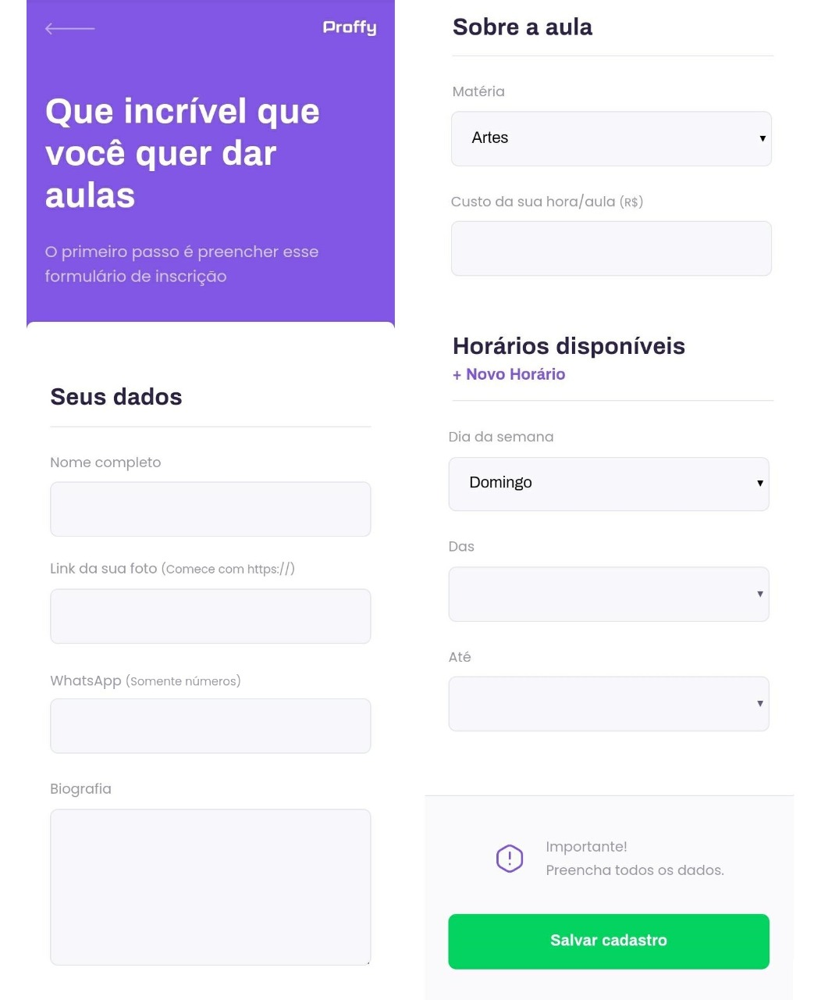

<h1 align="center">
    
</h1>

<p align="center">
  
  
  
</p>

<p align="center">
  <a href="#computer-projeto">Projeto</a>&nbsp;&nbsp;&nbsp;|&nbsp;&nbsp;&nbsp;
  <a href="#triangular_ruler-status">Status</a>&nbsp;&nbsp;&nbsp;|&nbsp;&nbsp;&nbsp;
  <a href="#memo-features">Features</a>&nbsp;&nbsp;&nbsp;|&nbsp;&nbsp;&nbsp;
  <a href="#camera-layouts">Layouts</a>&nbsp;&nbsp;&nbsp;|&nbsp;&nbsp;&nbsp;
  <a href="#arrow_forward-como-executar-o-projeto">Como executar o projeto</a>&nbsp;&nbsp;&nbsp;|&nbsp;&nbsp;&nbsp;
  <a href="#-tecnologias">Tecnologias</a>&nbsp;&nbsp;&nbsp;|&nbsp;&nbsp;&nbsp;
  <a href="#page_facing_up-licença">Licença</a>
</p>

## :computer: Projeto

Proffy - É uma plataforma online que ajuda pessoas que desejam aprender, sobre determinada matéria, com professores que desejam ensinar.
O projeto é desenvolvido para que estudantes e professores possam se conectar. Os professores realizam o cadastro na plataforma inserindo algumas informações como nome, matéria, horário disponíveis e whatsApp para contato.

Projeto desenvolvido durante a **NLW - Next Level Week#2** oferecida pela [Rocketseat](https://www.rocketseat.com.br).
O NLW é uma experiência online com muito conteúdo prático e desafios onde o conteúdo fica disponível durante uma semana.

---
## :triangular_ruler: **Status**

<h4 align="center"> 
	🚧  Em construção... 🚀 🚧
</h4>

---
## :memo: **Features**

- [x] Construir página inicial :computer::iphone:
- [x] Construir página de busca :computer::iphone:
- [x] Construir página de cadastro :computer::iphone:
- [x] Incluir novo horário no cadastro de professor :computer::iphone:
- [x] Construir servidor back end :computer:
- [x] Construir banco de dados :computer:
- [x] Criar consultas SQL :computer:
- [x] Construir funcionalidade de cadastrar professor no banco de dados :computer:
- [x] Construir funcionalidade buscar professor no banco de dados :computer:
- [ ] Adicionar a página de sucesso no redirecionamento do cadastro de professor :computer::iphone:
- [ ] Redirecionar a página de sucesso para a página de busca :computer::iphone:

---
## :camera: **Layouts**

<p align="center">
  <b> :iphone: MOBILE </b>
</p>

<div align="center">
  
</div>

<div align="center">
   
</div>

<p align="center">
  <b> :computer: DESKTOP </b>
</p>

<div align="center">
  <p align="center">
    
  </p>

  
  
</div>

---
## :arrow_forward: **Como executar o projeto**

```bash
# Clone este repositório
$ git clone <https://github.com/VictorPimentaTI/NLW-Proffy>

# Acesse a pasta do projeto no terminal
$ cd NLW-Proffy

# Instale as dependências
$ npm install

# Execute a aplicação em modo de desenvolvimento
$ npm run dev

# Feito isso, acesse <http://localhost:5500/>
```

---
## 🚀 **Tecnologias**

Esse projeto está sendo desenvolvido com as seguintes tecnologias:

- HTML5
- CSS3
- [JavaScript](https://www.javascript.com/)
- [Node.js](https://nodejs.org/pt-br/)
- [Express](https://expressjs.com/pt-br/)
- [Nodemon](https://nodemon.io)
- [Nunjucks](https://mozilla.github.io/nunjucks/)
- [SQLite](https://www.sqlite.org/index.html)

---

## Desenvolvido com :purple_heart: por Victor Pimenta

[](https://www.linkedin.com/in/victor-jos%C3%A9-pimenta)
[](https://github.com/VictorPimentaTI)
[](mailto:victorpimenta.ti@gmail.com)

---

## :page_facing_up: **Licença**

Copyright © 2020 [Victor Pimenta](https://github.com/VictorPimentaTI).<br />
This project is [MIT](./LICENSE) licensed.
